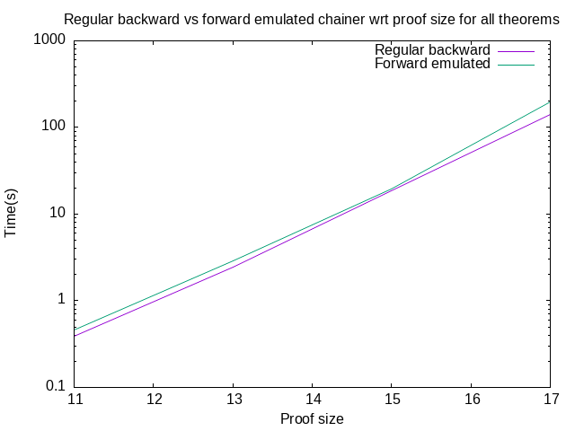
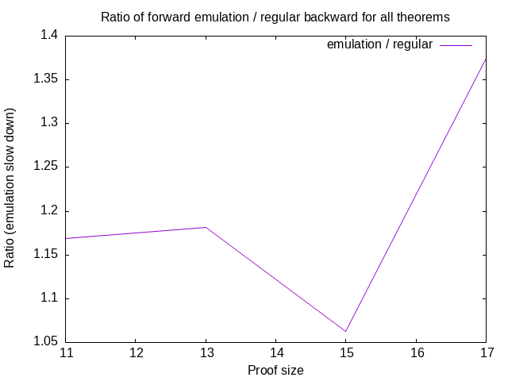
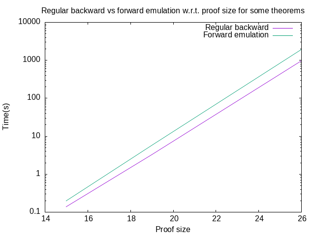
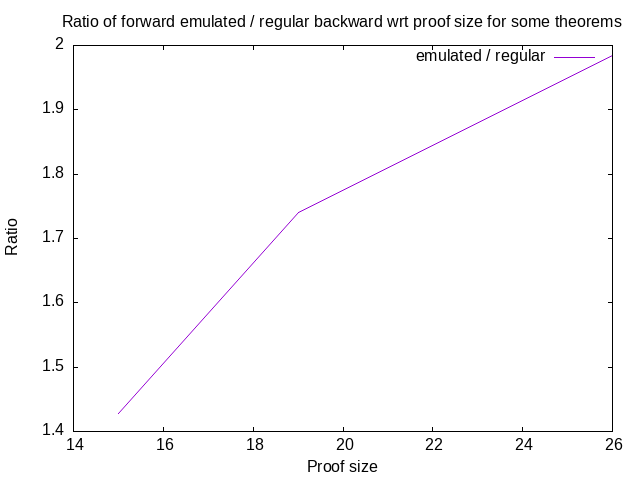

# Emulating Backward Chaining via Forward Chaining

## Overview

Forward chaining starts from a truth to produce more truth.  Backward
chainging on the other hand starts from a hypothesis to produce more
hypotheses (and possibly turns them into truths if reaches axioms).

There is actually a way to reconsile both approaches.

It is been already known that backward chaining can emulate forward
chainging by formulating the query `(: (. $x AXIOM) $a)` where `AXIOM`
is the name of the axiom to start forward chaining from.  Since the
proof is constrained to start from a given axiom and the theorem,
`$a`, is completely unconstrained, the backward chainer will have no
other option than producing proofs starting from the given axiom, that
is going forward.

It turns out one can also emulate backward chaining with forward
chaining.  It is a bit more complicated than just formulating the
right query.  First, inference rules have to be inverted, using here
the blackbird combinator:

```
(: .: (-> (-> $c $d)
          (-> (-> $a (-> $b $c))
              (-> $a
                  (-> $b
                      $d)))))
```

For instance applying the backbird to modus ponens

```
(: mp (-> (→ $a $b)
          (-> $a
              $b)))
```

produces

```
(: mpⁱ (-> (-> $b $c)
           (-> (→ $a $b)
               (-> $a
                   $c))))
```

Note how the conclusion, `$c`, is preserved in the input and the
output of rule, this is what allows to emulate backward expansion
while going forward.

Second, the target query `(: $x THEOREM)` must be turn into a source
query provided to the forward chainer, as follows:

`(: $x (-> THEOREM THEOREM))`

Then the forward chainer will have the effect of either expanding
backward using `mpⁱ` or eliminating hypotheses using the axioms and
will eventually reach `(: PROOF THEOREM)` if such proof exists.

## Experiments

To establish a fair comparison, it is important that both the backward
chainer and the forward chainer emulating backward chaining explore
exactly the same spaces, or rather isomorphic spaces.  To do that the
following changes must be operated:

1. The backward chainer must set a limit on the size of the proof
   rather than its depth.  This is actually a very good change because
   the size of search space grows super exponentially with the maximum
   depth of the proof, while it grows at most exponentially with the
   maximum size of the proof.  This provides a finer parameter to
   control the size of the search space and can dramatically speed up
   the search.
2. Due to the way the forward chainer emulates backward chaining, the
   forward chainer can keep the maximum depth as control parameter but
   must add an extra pruning parameter based on the number of
   hypotheses currently expanded.  If that number is greater than the
   depth (or the size, as they are the same) of the proof, then such
   proof will never reach the target because it not have possibility
   to eliminate all hypotheses.  This condition is crutial and allows
   to speed up the forward chainer many fold, to reach near parity
   with the backward chainer it is trying to emulate.

### Comparing Emulated vs Regular Backward Chaining in MeTTa

We begin our comparison in MeTTa only, to hopefully measure the
overhead of emulating backward chaining using forward chaining and
nothing else.  Once this has been establish we will move to a MORK
implementation, but for now we remain inside MeTTa using PeTTa as
back-end.

The code can be found in [bfc-xp.metta](bfc-xp.metta).  The main two
chainer implementations being compared are `obfc` which stands for
Optimized Backward via Forward Chainer, and `obc` which stands for
Optimized Backward Chainer.  Benchmarks of two types are conducted:

1. Over four exhaustive enumerations (all theorems and their proofs up
   to a certain size) of proof sizes, 11, 13, 15 and 17 respectively.
1. Over three theorems selected from the Metamath corpus with varying
   proof sizes, 15, 19 and 26 respectively.

The data obtained from these experiments have been compiled in
[regular-vs-emulated-petta-benchmark.csv](regular-vs-emulated-petta-benchmark.csv)
and are plotted below.









